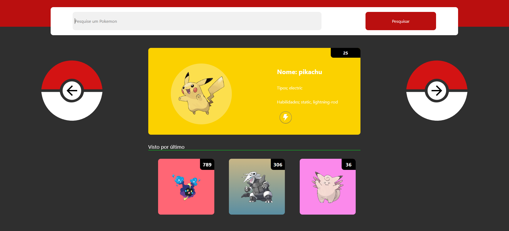

<h2 align = "center"> 
    
        Pokédex React 
    
</h2> 

    
    
    

    

## 💻 Projeto

    Desenvolver um programa web para a visualização de pokémons e alguns atributos, como nome, tipo e habilidades. Para criar esse projeto foi utilizado o framework 
    <a href="https://pt-br.reactjs.org/">React</a>.
    Além disso, os dados de cada pokémon são requisitados por meio da API Rest
    <a href="https://pokeapi.co/">PokéApi</a>.

    O desing do projeto foi desenhado por mim, aqui vocês podem ver o <a href="https://pokedex-react-sage.vercel.app/">site</a> funcionando.

### Funcionalidades
 - [x] **Listagem dos pokémons**: Listar os pokémons com o uso da API REST.
- [x] **Listagem dos últimos pokémons vistos**: Gerar cards com os últimos 3 pokémons vistos.
- [x] **Buscar pokémons**: Método para filtrar os pokémons a partir do seu nome ou id.
- [x] **Botões para trocar de pokémon**: Botões funcionais para passar entre os pokémons usando o ID de cada um. Os botões só funcionam entre os IDs 1 e 898, e assim que chegam entre os limites os botões para de funcionar.
- [x] **Pokémons aleatórios**: Cada vez que a página é atualizada um pokémon aleatório aparece na Card príncipal.
- [x] **Tratamento de valores inválidos no input**: O programa apresenta uma sinalização caso um valor inválido seja inserido e não realiza a pesquisa.
- [x] **Cor do card personalizada**: As cores do card variam conforme o(s) tipo(s) do pokémon.
- [x] **Layout responsivo**: A plataforma adapta o layout em vários dispositivos com tamanhos e resoluções diferentes.

### Conceitos abordados
- Uso de flexbox para alinhar e ajustar elementos na página.
- Consumo de api com o uso da lib [axios](https://github.com/axios/axios).
- Uso de hooks para controlar os pokémons pesquisados.
- Controle na listagem dos últimos pokémons visto por meio de um array.
- Controle dos cards com a cor dos pokémons por meio de um array de constantes.

### Notas
- O maior ID na listado é 898, pois a partir desse número a API apresenta alguns erros nas informações do pokémon, como imagem, caracteríscas e outros.

## :rocket: Tecnologias

-  [React](https://pt-br.reactjs.org/)
-  [Axios](https://github.com/axios/axios)
-  [React Router](https://reactrouter.com/web/guides/quick-start)

